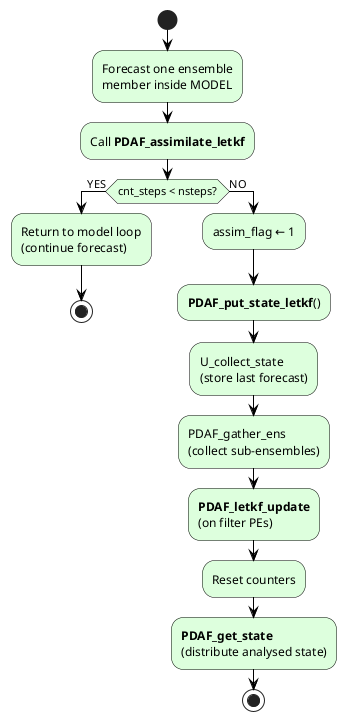
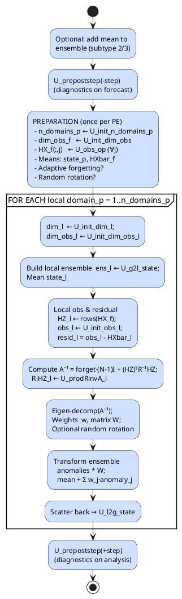

# Review of the letkf algorithm
_Exported on 5/29/2025 at 21:01:33 GMT+8 from Cursor (0.50.7)_

---

**User**

Please review the letkf algorithm

---

**Cursor**

Below is a functional walkthrough of the Local Ensemble Transform Kalman Filter (LETKF) as it is implemented in PDAF  together with notes on where the algorithmic steps appear in the sources you showed.  The aim is to give you a "road-map" so you can quickly locate or modify individual pieces.

-------------------------------------------------------------
1. High-level control flow
-------------------------------------------------------------
1.  Your forecast model is advanced member-by-member.  
    • At the end of every model time step the model calls  
      `PDAF_assimilate_letkf*` (either the long interface or the simplified `*_si` wrapper).  
    • Inside that routine a simple counter (`cnt_steps`) decides whether the present time step is an analysis time.  
    • If not, the call just returns and your model continues forecasting.  
    • If yes, it calls

        CALL PDAF_put_state_letkf( … )

    to hand the forecast ensemble to the filter.

2.  `PDAF_put_state_letkf.F90`
    • Saves the just-computed forecast member into the ensemble matrix `eofV`.  
    • After the last member of the ensemble has finished, all model PEs send their sub-ensemble to the filter PEs (`PDAF_gather_ens`).  
    • On the filter PEs the routine

        CALL PDAF_letkf_update( … )

    is invoked – this is the real analysis step.  
    • Afterwards counters are reset and a new forecast phase begins (`PDAF_get_state` in `PDAF_assimilate_letkf.F90`).

-------------------------------------------------------------
2. `PDAF_letkf_update.F90`  (analysis driver)
-------------------------------------------------------------
For clarity all variables with the suffix "_p" are PE-local (whole model domain on one MPI task), "_l" are truly local (current local analysis sub-domain), "_f" are full observation vectors needed on that PE.

Steps inside `PDAF_letkf_update`:

1.  (Optional) convert ensemble anomalies back to physical states if you run the "fixed covariance" variant (subtype = 2/3).

2.  `U_prepoststep` is called **before** the analysis with a negative time step number so you can inspect the pure forecast ensemble.

3.  Preparation of quantities that are needed for *all* local domains on the PE:  
    • Determine number of local analysis domains (`U_init_n_domains_p`).  
    • Determine the total obs dimension on that PE (`U_init_dim_obs`).  
    • For every ensemble member apply the observation operator (`U_obs_op`) → matrix `HX_f(dim_obs_f, dim_ens)`.  
    • Compute ensemble mean in state and obs space (`state_p`, `HXbar_f`).  
    • Adaptive forgetting factor: if requested (`type_forget` = 1) call `PDAF_set_forget`.  
    • Generate the (optional) orthogonal random rotation matrix that is used when `type_trans` = 2.

4.  Enter the OpenMP-parallel loop over **local analysis domains** (`domain_p = 1 … n_domains_p`)  
    In each iteration:
    a) Query local state and obs dimensions (`U_init_dim_l`, `U_init_dim_obs_l`).  
    b) Build local forecast ensemble `ens_l(dim_l,dim_ens)` and mean state `state_l` by calling `U_g2l_state`.  
    c) Build local obs ensemble `HZ_l` by cutting out the rows of `HX_f`, and the observation vector `obs_l` (`U_g2l_obs`, `U_init_obs_l`).  
    d) Compute residual `d = y − Hx` and (optionally) omit large innovations.  
    e) Form  

           A⁻¹ = forget·(N−1)·I + (HZ)ᵀ R⁻¹ HZ

       The product with R⁻¹ is delivered by the user callback `U_prodRinvA_l`.  
    f) Invert A⁻¹ via an eigen decomposition (LAPACK SYEV) to get eigenvectors `A_inv` and eigenvalues `svals`.  
       – If `type_forget == 2` the forgetting factor can be adapted *per domain* via `PDAF_set_forget_local`.  
    g) Compute analysis weights  

           w      =   A · (HZ)ᵀ R⁻¹ d
           W  =  √(N−1) · A½          (used to transform anomalies)

    h) Apply random rotation (`rndmat`) if `type_trans==2`.  
    i) Update ensemble anomalies and ensemble mean:  
       • call `PDAF_etkf_Tright` and `PDAF_etkf_Tleft` helpers to keep the "remove-mean" operator in matrix form (the "T-matrix" formulation, subtype 0/2) or invoke the original Hunt-style formulas (subtype 1).  
    j) Convert back from local domain to full PE domain (`U_l2g_state`) and add analysed increments.  
    k) Collect statistics and memory counters, then loop to next domain.

5.  After the loop finishes, `U_prepoststep` is called again (positive time step) so the user can inspect the *analysed* ensemble.

6.  If an ensemble smoother is activated (`dim_lag > 0`) `sens_p` keeps the lagged increments.

-------------------------------------------------------------
3.  Variants & options
-------------------------------------------------------------
• `subtype`  
 0  = LETKF with T-matrix (default)  
 1  = Hunt et al. (2007) formulation  
 2  = Fixed error-subspace (error basis doesn't evolve)  
 3  = as 2, but with global covariance matrix fixed in time

• `type_trans`  
 0  = no rotation (serial square-root)  
 1  = random rotation each cycle  
 2  = random rotation drawn *once* and reused every cycle

• `type_forget`  
 0  = fixed forgetting factor  
 1  = adapt factor *globally*  
 2  = adapt factor *per local domain* (Scale-dependent LETKF)

• OpenMP:  
   The complete local-domain loop is threaded.  Only thread 0 prints to the screen.

-------------------------------------------------------------
4.  Places to hook in user code
-------------------------------------------------------------
Mandatory user callbacks (you saw them in the interface list):

• `U_collect_state` / `U_distribute_state` – model ⇄ vector I/O  
• `U_obs_op` – \( H \) operator  
• Dimension and index providers: `U_init_dim_*`, `U_g2l_*`, `U_l2g_*`  
• Observation data: `U_init_obs[_l]`, `U_init_obsvar[_l]`, `U_prodRinvA_l`  
• `U_prepoststep` – diagnostics, localisation tuning, inflation, etc.  
• `U_next_observation` – tells PDAF when the next analysis is due

-------------------------------------------------------------
5.  Quick guide to relevant files
-------------------------------------------------------------
• Driver & interfaces  
  – `src/PDAF_assimilate_letkf*.F90`  
  – `src/PDAF_put_state_letkf*.F90`

• Analysis driver  
  – `src/PDAF_letkf_update.F90`

• Core mathematics  
  – `src/PDAF_letkf_analysis_T.F90`  (T-matrix version)  
  – `src/PDAF_letkf_analysis.F90`    (Hunt et al. version)

• Helpers  
  – `src/PDAF_etkf_Tright.F90`, `PDAF_etkf_Tleft.F90` (mean removal)  
  – `src/PDAF_generate_rndmat.F90`, `PDAF_set_forget*.F90`, etc.

-------------------------------------------------------------
Key take-aways
-------------------------------------------------------------
1.  The PDAF LETKF is thoroughly modular: all model-dependent parts are isolated in user callbacks; PDAF core never "knows" your model grid or obs formats.  
2.  Domain localisation is fully supported; the local updates are OpenMP-parallel and run independently on every PE.  
3.  A versatile set of options (random rotation, adaptive inflation, different square-root formulations) can be activated simply by parameter settings; no code changes are required.  
4.  Because the algorithm stores ensemble anomalies in "T-matrix" form, mean removal is done by very cheap matrix multiplications instead of explicit subtraction loops, which reduces computational cost for large ensembles.

This should give you a concise, code-oriented overview of how the LETKF algorithm is realised in PDAF and where to step in for customisation.

---

**User**

Can you present the algorithm with some kind of flowcharts?

---

**Cursor**

Below are two complementary flow-charts that capture the logic you just browsed in the source code.  
• Chart 1 shows the complete *forecast ↔ analysis* cycle as the model executes.  
• Chart 2 zooms into what happens inside the LETKF analysis itself on the filter PEs.

(Everything is pure text / ASCII so you can paste it into documentation or comments.)

────────────────────────────────────────────────────────────
Chart 1 – Overall PDAF–LETKF coupling inside the model loop
────────────────────────────────────────────────────────────
```text
┌───────────────────────────────┐
│   MODEL: advance one member   │
└─────────────┬─────────────────┘
              │
              ▼
╔════════════════════════════════════════╗
║ PDAF_assimilate_letkf(_si)            ║
╚════════════════════════════════════════╝
       │
       │cnt_steps < nsteps ?       cnt_steps == nsteps ?
       │(forecast continues)       (analysis needed)
┌──────┴───────┐                 ┌────────────────────────────────────┐
│ return to    │                 │ 1. set assim_flag                  │
│ model loop   │                 │ 2. CALL PDAF_put_state_letkf       │
└──────────────┘                 └─────────────────┬──────────────────┘
                                                   ▼
                             ╔═════════════════════════════════════╗
                             ║ PDAF_put_state_letkf                ║
                             ║  • U_collect_state (save member)    ║
                             ║  • PDAF_gather_ens                  ║
                             ║  • CALL PDAF_letkf_update           ║
                             ║  • reset counters                   ║
                             ╚═════════════════════════════════════╝
                                                   │
                     ┌─────────────────────────────┴─────────────────────────────┐
                     ▼                                                           ▼
           (filter PEs only)                                            (all PEs)
╔══════════════════════════════╗                    ╔════════════════════════════╗
║  PDAF_letkf_update           ║                    ║  back to model PEs         ║
║  (see Chart 2)               ║                    ║  • PDAF_get_state          ║
╚══════════════════════════════╝                    ╚════════════════════════════╝
                     │
                     ▼
            ensemble analysed
```

────────────────────────────────────────────────────────────
Chart 2 – Detailed LETKF analysis on a filter PE
────────────────────────────────────────────────────────────
```text
╔══════════════════════════════════════════════════════════════╗
║ PDAF_letkf_update                                            ║
╚══════════════════════════════════════════════════════════════╝
        │
        ▼
┌──────────────────────────────────────────────────────────────┐
│ 0. (optional) add mean to errors if subtype = 2/3           │
└──────────────────────────────────────────────────────────────┘
        │
        ▼
┌──────────────────────────────────────────────────────────────┐
│ 1. U_prepoststep(-step)   ← user diagnostics on forecast     │
└──────────────────────────────────────────────────────────────┘
        │
        ▼
┌──────────────────────────────────────────────────────────────┐
│ 2. PREPARATION (PE-local, once)                              │
│    • n_domains_p   ← U_init_n_domains_p                      │
│    • dim_obs_f     ← U_init_dim_obs                          │
│    • HX_f(:,j)     ← U_obs_op  (∀ ensemble members)          │
│    • state_p, HXbar_f  (ensemble means)                      │
│    • (optional) adaptive forget + rnd. rotation matrix       │
└──────────────────────────────────────────────────────────────┘
        │
        ▼  (OpenMP parallel)
┌──────────────────────────────────────────────────────────────┐
│ 3. LOOP domain_p = 1 … n_domains_p                           │
│   ┌────────────────────────────────────────────────────────┐ │
│   │ a. local sizes:                                         │ │
│   │    dim_l  ← U_init_dim_l                                │ │
│   │    dim_obs_l ← U_init_dim_obs_l                         │ │
│   └────────────────────────────────────────────────────────┘ │
│   ┌────────────────────────────────────────────────────────┐ │
│   │ b. Build local state ensemble & mean                   │ │
│   │    ens_l ← U_g2l_state (∀ members)                     │ │
│   │    state_l← U_g2l_state (mean)                         │ │
│   └────────────────────────────────────────────────────────┘ │
│   ┌────────────────────────────────────────────────────────┐ │
│   │ c. Local obs & residual                                │ │
│   │    HZ_l ← rows of HX_f                                 │ │
│   │    obs_l ← U_init_obs_l                                │ │
│   │    resid_l = obs_l − HXbar_l                           │ │
│   └────────────────────────────────────────────────────────┘ │
│   ┌────────────────────────────────────────────────────────┐ │
│   │ d. Build   A⁻¹ = forget·(N−1)I + (HZ)ᵀ R⁻¹ HZ          │ │
│   │    RiHZ_l ← U_prodRinvA_l                              │ │
│   └────────────────────────────────────────────────────────┘ │
│   ┌────────────────────────────────────────────────────────┐ │
│   │ e. Eigen-decomposition of A⁻¹  → eigenvalues s, vecs   │ │
│   │    Compute                                               │ │
│   │       w  =  A · (HZ)ᵀ R⁻¹ resid                          │ │
│   │       W  = √(N−1) · A½  (optional random rotation)       │ │
│   └────────────────────────────────────────────────────────┘ │
│   ┌────────────────────────────────────────────────────────┐ │
│   │ f. Update ensemble                                      │ │
│   │    • anomalies:  ens_l = ens_l · W                      │ │
│   │    • mean:      state_l = state_l + Σ_j w_j * ens_l(:,j)│ │
│   └────────────────────────────────────────────────────────┘ │
│   ┌────────────────────────────────────────────────────────┐ │
│   │ g. Scatter back to PE domain:                           │ │
│   │       U_l2g_state(state_l + increment)                  │ │
│   └────────────────────────────────────────────────────────┘ │
│ END LOOP                                                   │
└──────────────────────────────────────────────────────────────┘
        │
        ▼
┌──────────────────────────────────────────────────────────────┐
│ 4. U_prepoststep(+step)   ← user diagnostics on analysis     │
└──────────────────────────────────────────────────────────────┘
```

Legend  
• White boxes = algorithmic steps implemented in PDAF core.  
• Gray/double-border boxes = PDAF subroutine you see in the code.  
• Italic names beginning with `U_` = user-supplied callback hooks.

These diagrams should help you orient yourself quickly when reading or modifying the implementation.

```plaintext
┌───────────────────────────────┐
│   MODEL: advance one member   │
└─────────────┬─────────────────┘
              │
              ▼
╔════════════════════════════════════════╗
║ PDAF_assimilate_letkf(_si)            ║
╚════════════════════════════════════════╝
       │
       │cnt_steps < nsteps ?       cnt_steps == nsteps ?
       │(forecast continues)       (analysis needed)
┌──────┴───────┐                 ┌────────────────────────────────────┐
│ return to    │                 │ 1. set assim_flag                  │
│ model loop   │                 │ 2. CALL PDAF_put_state_letkf       │
└──────────────┘                 └─────────────────┬──────────────────┘
                                                   ▼
                             ╔═════════════════════════════════════╗
                             ║ PDAF_put_state_letkf                ║
                             ║  • U_collect_state (save member)    ║
                             ║  • PDAF_gather_ens                  ║
                             ║  • CALL PDAF_letkf_update           ║
                             ║  • reset counters                   ║
                             ╚═════════════════════════════════════╝
                                                   │
                     ┌─────────────────────────────┴─────────────────────────────┐
                     ▼                                                           ▼
           (filter PEs only)                                            (all PEs)
╔══════════════════════════════╗                    ╔════════════════════════════╗
║  PDAF_letkf_update           ║                    ║  back to model PEs         ║
║  (see Chart 2)               ║                    ║  • PDAF_get_state          ║
╚══════════════════════════════╝                    ╚════════════════════════════╝
                     │
                     ▼
            ensemble analysed
```

```plaintext
╔══════════════════════════════════════════════════════════════╗
║ PDAF_letkf_update                                            ║
╚══════════════════════════════════════════════════════════════╝
        │
        ▼
┌──────────────────────────────────────────────────────────────┐
│ 0. (optional) add mean to errors if subtype = 2/3           │
└──────────────────────────────────────────────────────────────┘
        │
        ▼
┌──────────────────────────────────────────────────────────────┐
│ 1. U_prepoststep(-step)   ← user diagnostics on forecast     │
└──────────────────────────────────────────────────────────────┘
        │
        ▼
┌──────────────────────────────────────────────────────────────┐
│ 2. PREPARATION (PE-local, once)                              │
│    • n_domains_p   ← U_init_n_domains_p                      │
│    • dim_obs_f     ← U_init_dim_obs                          │
│    • HX_f(:,j)     ← U_obs_op  (∀ ensemble members)          │
│    • state_p, HXbar_f  (ensemble means)                      │
│    • (optional) adaptive forget + rnd. rotation matrix       │
└──────────────────────────────────────────────────────────────┘
        │
        ▼  (OpenMP parallel)
┌──────────────────────────────────────────────────────────────┐
│ 3. LOOP domain_p = 1 … n_domains_p                           │
│   ┌────────────────────────────────────────────────────────┐ │
│   │ a. local sizes:                                         │ │
│   │    dim_l  ← U_init_dim_l                                │ │
│   │    dim_obs_l ← U_init_dim_obs_l                         │ │
│   └────────────────────────────────────────────────────────┘ │
│   ┌────────────────────────────────────────────────────────┐ │
│   │ b. Build local state ensemble & mean                   │ │
│   │    ens_l ← U_g2l_state (∀ members)                     │ │
│   │    state_l← U_g2l_state (mean)                         │ │
│   └────────────────────────────────────────────────────────┘ │
│   ┌────────────────────────────────────────────────────────┐ │
│   │ c. Local obs & residual                                │ │
│   │    HZ_l ← rows of HX_f                                 │ │
│   │    obs_l ← U_init_obs_l                                │ │
│   │    resid_l = obs_l − HXbar_l                           │ │
│   └────────────────────────────────────────────────────────┘ │
│   ┌────────────────────────────────────────────────────────┐ │
│   │ d. Build   A⁻¹ = forget·(N−1)I + (HZ)ᵀ R⁻¹ HZ          │ │
│   │    RiHZ_l ← U_prodRinvA_l                              │ │
│   └────────────────────────────────────────────────────────┘ │
│   ┌────────────────────────────────────────────────────────┐ │
│   │ e. Eigen-decomposition of A⁻¹  → eigenvalues s, vecs   │ │
│   │    Compute                                               │ │
│   │       w  =  A · (HZ)ᵀ R⁻¹ resid                          │ │
│   │       W  = √(N−1) · A½  (optional random rotation)       │ │
│   └────────────────────────────────────────────────────────┘ │
│   ┌────────────────────────────────────────────────────────┐ │
│   │ f. Update ensemble                                      │ │
│   │    • anomalies:  ens_l = ens_l · W                      │ │
│   │    • mean:      state_l = state_l + Σ_j w_j * ens_l(:,j)│ │
│   └────────────────────────────────────────────────────────┘ │
│   ┌────────────────────────────────────────────────────────┐ │
│   │ g. Scatter back to PE domain:                           │ │
│   │       U_l2g_state(state_l + increment)                  │ │
│   └────────────────────────────────────────────────────────┘ │
│ END LOOP                                                   │
└──────────────────────────────────────────────────────────────┘
        │
        ▼
┌──────────────────────────────────────────────────────────────┐
│ 4. U_prepoststep(+step)   ← user diagnostics on analysis     │
└──────────────────────────────────────────────────────────────┘
```

---

**User**

Presented with PlantUML ?

---

**Cursor**

Below are two ready-to-paste PlantUML activity charts.

-----------------------------------------------------------------
1. Overall PDAF‒LETKF coupling inside the model integration loop
-----------------------------------------------------------------


-----------------------------------------------------------------
2. Detailed steps inside **PDAF_letkf_update** (filter PE)
-----------------------------------------------------------------


How to use  
1. Copy each block (including the `@startuml … @enduml` lines) into any PlantUML renderer—e.g. the online server (https://www.plantuml.com/plantuml) or the IntelliJ / VS Code PlantUML plug-in.  
2. Export as PNG, SVG, or embed directly in your documentation/readme.

```plaintext
@startuml PDAF_Letkf_Overall
skinparam ArrowColor Black
skinparam ActivityBorderColor Black
skinparam ActivityBackgroundColor #DDFFDD
skinparam DecisionBorderColor Black
skinparam DecisionBackgroundColor #FFE6CC
skinparam DiamondBackgroundColor #FFE6CC

start
:Forecast one ensemble\nmember inside MODEL;
:Call **PDAF_assimilate_letkf**;
if (cnt_steps < nsteps?) then (YES)
  :Return to model loop\n(continue forecast);
  stop
else (NO)
  :assim_flag ← 1;
  :**PDAF_put_state_letkf**();
  :U_collect_state\n(store last forecast);
  :PDAF_gather_ens\n(collect sub-ensembles);
  :**PDAF_letkf_update**\n(on filter PEs);
  :Reset counters;
  :**PDAF_get_state**\n(distribute analysed state);
  stop
endif
@enduml
```

```plaintext
@startuml PDAF_Letkf_Analysis
skinparam ActivityBorderColor Black
skinparam ActivityBackgroundColor #D0E0FF
skinparam DecisionBorderColor Black
skinparam DecisionBackgroundColor #FFE6CC
skinparam DiamondBackgroundColor #FFE6CC

start
:Optional: add mean to\nensemble (subtype 2/3);
:U_prepoststep(-step)\n(diagnostics on forecast);

:PREPARATION (once per PE)\n - n_domains_p ← U_init_n_domains_p\n - dim_obs_f   ← U_init_dim_obs\n - HX_f(:,j)   ← U_obs_op (∀j)\n - Means: state_p, HXbar_f\n - Adaptive forgetting?\n - Random rotation?;

partition "FOR EACH local domain_p = 1..n_domains_p" {
  :dim_l  ← U_init_dim_l;\ndim_obs_l ← U_init_dim_obs_l;
  :Build local ensemble  ens_l ← U_g2l_state;\nMean state_l;
  :Local obs & residual\n  HZ_l ← rows(HX_f);\n  obs_l ← U_init_obs_l;\n  resid_l = obs_l - HXbar_l;
  :Compute A⁻¹ = forget·(N-1)I + (HZ)ᵀR⁻¹HZ;\n  RiHZ_l ← U_prodRinvA_l;
  :Eigen-decomp(A⁻¹);\nWeights  w, matrix W;\nOptional random rotation;
  :Transform ensemble\n  anomalies * W;\n  mean + Σ w_j·anomaly_j;
  :Scatter back → U_l2g_state;
}

:U_prepoststep(+step)\n(diagnostics on analysis);
stop
@enduml
```

---

**User**

Please summarize the mathmatic forumula of the letkf with markdown syntax

---

**Cursor**

### Local Ensemble Transform Kalman Filter (LETKF) – key formulas  

Below \(N\) is the ensemble size, bold symbols are matrices, plain bold-lowercase are column vectors, superscripts \(f,a\) denote **forecast** and **analysis**.

---

#### 1. Build forecast quantities  

```math
\begin{align*}
\bar{\mathbf x}^f      &= \frac{1}{N}\sum_{i=1}^{N}\mathbf x_i^f   && \text{mean state} \\
\mathbf X'^{\,f}       &= \bigl[\,\mathbf x_1^f-\bar{\mathbf x}^f\,\;\cdots\;\mathbf x_N^f-\bar{\mathbf x}^f\bigr] && \text{state anomalies} \\[4pt]
\bar{\mathbf y}^f      &= \frac{1}{N}\sum_{i=1}^{N}\mathbf y_i^f, \\
\mathbf Y'^{\,f}    &= \bigl[\,\mathbf y_1^f-\bar{\mathbf y}^f\,\;\cdots\;\mathbf y_N^f-\bar{\mathbf y}^f\bigr] && \text{in obs space}
\end{align*}
```

with \(\mathbf y_i^f = H\mathbf x_i^f\) and observation error covariance **R**.

---

#### 2. Innovation  

```math
\mathbf d \;=\; \mathbf y^{\text{obs}}-\bar{\mathbf y}^f
```

---

#### 3. "Ensemble–space" gain matrices  

Define the **ensemble-space inverse matrix**

```math
\mathbf A^{-1}
   \;=\;
   \underbrace{\alpha (N-1)\mathbf I}_{\text{(optional) multiplicative inflation}}
   \;+\;
   \mathbf Y'^{f\,\! \top}\,\mathbf R^{-1}\,\mathbf Y'^{\,f}
```

where the scalar \(\alpha\ge 1\) is the (adaptive) forgetting / inflation factor.  
Then

```math
\begin{align*}
\mathbf{P}   &= \mathbf{A}^{-1}      && \text{analysis error in ensemble space} \\[4pt]
\bar{\mathbf{w}}^a &= \mathbf{P}\,(\mathbf{Y}^{f})'^{\!\top}\mathbf{R}^{-1}\mathbf{d}
                                       && \text{weights for the mean} \\[4pt]
\mathbf{W}^a &= \sqrt{N-1}\;\mathbf{P}^{1/2}\,\mathbf{Q}
                                       && \text{square-root for anomalies}
\end{align*}
```

* \(\mathbf P^{1/2}\) is any symmetric square-root of **P**  
* \(\mathbf Q\) is an orthogonal matrix  
  - **Identity** → deterministic square-root LETKF  
  - **Random rotation** → stochastic LETKF option implemented in PDAF (`type_trans = 2`)

---

#### 4. Analysis update in state space  

```math
\bar{\mathbf x}^a
      \;=\;
      \bar{\mathbf x}^f \;+\; \mathbf X'^{\,f}\,\bar{\mathbf w}^a
```

```math
\mathbf X'^{\,a}
      \;=\;
      \mathbf X'^{\,f}\,\mathbf W^a
```

The full analysed ensemble is then

```math
\mathbf X^{\,a}
      \;=\;
      \bar{\mathbf x}^a\mathbf 1^{\top} \;+\; \mathbf X'^{\,a}
```

---

#### 5. Localisation / domain decomposition  

All formulas above are applied **independently** for each local analysis domain \( \mathcal{D}_\ell \):

• Replace every state vector by its restriction to \( \mathcal{D}_\ell\).  
• Replace **H**, **R**, **Y** accordingly (only observations that influence \( \mathcal{D}_\ell\)).  
• The resulting increments are scattered back to the global grid.

This yields flow-dependent localisation with no taper functions—only a hard cut-off via the sub-domains you provide in the user callbacks.

---

#### 6. Relationship to Kalman gain  

The conventional gain \( \mathbf K \) appears implicitly:

```math
\mathbf K
   \;=\;
   \mathbf X'^{\,f}\,\mathbf P\,\mathbf Y'^{f\,\!\top}\,\mathbf R^{-1}
```

so that \( \bar{\mathbf x}^a = \bar{\mathbf x}^f + \mathbf K\,\mathbf d \).  
However LETKF never forms **K** explicitly; all computations stay in the low-dimensional ensemble space (\(N \times N\)).

---

These compact equations correspond exactly to the implementation you saw in  
`PDAF_letkf_analysis_T.F90` (T-matrix variant) and `PDAF_letkf_update.F90`.

```math
\begin{align*}
\bar{\mathbf x}^f      &= \frac{1}{N}\sum_{i=1}^{N}\mathbf x_i^f   && \text{mean state} \\
\mathbf X'^{\,f}       &= \bigl[\,\mathbf x_1^f-\bar{\mathbf x}^f\,\;\cdots\;\mathbf x_N^f-\bar{\mathbf x}^f\bigr] && \text{state anomalies} \\[4pt]
\bar{\mathbf y}^f      &= \frac{1}{N}\sum_{i=1}^{N}\mathbf y_i^f, \\
\mathbf Y'^{\,f}    &= \bigl[\,\mathbf y_1^f-\bar{\mathbf y}^f\,\;\cdots\;\mathbf y_N^f-\bar{\mathbf y}^f\bigr] && \text{in obs space}
\end{align*}
```

```math
\mathbf d \;=\; \mathbf y^{\text{obs}}-\bar{\mathbf y}^f
```

```math
\mathbf A^{-1}
   \;=\;
   \underbrace{\alpha (N-1)\mathbf I}_{\text{(optional) multiplicative inflation}}
   \;+\;
   \mathbf Y'^{f\,\! \top}\,\mathbf R^{-1}\,\mathbf Y'^{\,f}
```

```math
\begin{align*}
\mathbf P   \;=\; \mathbf A^{-1}      &&\text{analysis error in ensemble space}\\[4pt]
\bar{\mathbf w}^a \;=\; \mathbf P\,\mathbf Y'^{f\,\! \top}\mathbf R^{-1}\mathbf d
                                       &&\text{weights for the mean}\\[4pt]
\mathbf W^a = \sqrt{N-1}\;\mathbf P^{1/2}\,\mathbf Q
                                       &&\text{square-root for anomalies}
\end{align*}
```

```math
\bar{\mathbf x}^a
      \;=\;
      \bar{\mathbf x}^f \;+\; \mathbf X'^{\,f}\,\bar{\mathbf w}^a
```

```math
\mathbf X'^{\,a}
      \;=\;
      \mathbf X'^{\,f}\,\mathbf W^a
```

```math
\mathbf X^{\,a}
      \;=\;
      \bar{\mathbf x}^a\mathbf 1^{\top} \;+\; \mathbf X'^{\,a}
```

```math
\mathbf K
   \;=\;
   \mathbf X'^{\,f}\,\mathbf P\,\mathbf Y'^{f\,\!\top}\,\mathbf R^{-1}
```

---

**User**

Thinking of rewritting the letkf algorithm with C++, assuming we have State class, Observation class, Model class, what else classes are needed ?

---

**Cursor**

Below is a pragmatic class checklist for a clean, modular C++ re-implementation of LETKF.  
(You already have `State`, `Observation`, `Model`.)

────────────────────────────────────────────────────────
1. Core data containers
────────────────────────────────────────────────────────
1. `Ensemble<State>`  
   • `std::vector<State>` members  
   • mean(), anomalies(), size() …

2. `EnsembleSpaceMatrix`  
   • small \(N\times N\) matrices that live in "ensemble space" ( **A**, **W**, random rotation, …)  
   • eigen-decomposition, square-root, etc.

3. `AnalysisDomain` (or `LocalDomain`)  
   • holds indices/weights describing one localisation patch  
   • maps full `State` ⇄ local vectors

────────────────────────────────────────────────────────
2. Algorithm actors
────────────────────────────────────────────────────────
4. `ObservationOperator` (abstract base)  
   • `Vector apply(const State&) const`  
   • concrete subclasses for each obs-type

5. `InflationStrategy` / `ForgettingFactor` (policy class)  
   • `double compute(const LocalStats&)`

6. `RandomRotation` (policy)  
   • builds orthogonal matrix; choose `none | per-cycle | fixed`

7. `LETKF` (main orchestrator)  
   • references to `Ensemble<State>`, `ObservationSet`, `ObservationOperator`, policies  
   • `analyse()` loops over `AnalysisDomain`s, updates ensemble

8. `AssimilationDriver` (high-level state machine)  
   • couples `Model` forecast with `LETKF` analysis  
   • keeps counters, calls user hooks (`prePostStep()`)

────────────────────────────────────────────────────────
3. Infrastructure / utilities
────────────────────────────────────────────────────────
9. `LinearAlgebra` façade  
   • thin wrappers for LAPACK/Eigen/Armadillo (gemm, syev, …)

10. `MPICommunicator` (or use `mpi4cpp` / `boost::mpi`)  
    • gather/scatter ensemble, broadcast parameters

11. `Config` / `ParameterSet`  
    • all tunable integers, doubles, flags

12. `Diagnostics`  
    • RMSE, spread, innovation stats; writes to log / NetCDF

13. (Optional) `RandomEngine` (shared RNG with parallel safety)

────────────────────────────────────────────────────────
Relationships in a nutshell (UML-lite)
────────────────────────────────────────────────────────
```
Model  --> Forecast(State)
            ▲
            │ uses
AssimilationDriver --> LETKF --> Ensemble<State>
                              ↘
  ObservationSet --> ObservationOperator
  InflationStrategy ─┘        RandomRotation ─┘
```

• `AssimilationDriver` keeps the loop: forecast → analyse → redistribute.  
• `LETKF` owns the maths; it *consults* policies (`InflationStrategy`, `RandomRotation`) so you can switch implementations at runtime.  
• `AnalysisDomain` is used inside `LETKF` to localise each update.  
• `MPICommunicator` only appears inside driver/ensemble methods, keeping numerics independent from parallel details.

With this set you have clear separation of concerns, testable units, and flexibility to plug in different localisation or inflation schemes without touching the core mathematics.

```plaintext
Model  --> Forecast(State)
            ▲
            │ uses
AssimilationDriver --> LETKF --> Ensemble<State>
                              ↘
  ObservationSet --> ObservationOperator
  InflationStrategy ─┘        RandomRotation ─┘
```

---

**User**

Write a C++ pseudo code of LETKF with the classes your proposed.

---

**Cursor**

Below is a C++ pseudocode implementation of LETKF using the proposed classes:

```cpp
//─────────────────────────────────────────────────────────────
// Core data containers
//─────────────────────────────────────────────────────────────
template<typename StateType>
class Ensemble {
public:
    std::vector<StateType> members;
    
    StateType mean() const {
        StateType avg = members[0];
        for (size_t i = 1; i < members.size(); ++i)
            avg += members[i];
        return avg / members.size();
    }
    
    Matrix anomalies() const {
        auto avg = mean();
        Matrix X(avg.size(), members.size());
        for (size_t i = 0; i < members.size(); ++i) {
            X.col(i) = (members[i] - avg).toVector();
        }
        return X;
    }
    
    size_t size() const { return members.size(); }
};

class EnsembleSpaceMatrix {
public:
    Matrix data;
    
    EnsembleSpaceMatrix(int n) : data(n, n) {}
    
    std::pair<Vector, Matrix> eigenDecomposition() const {
        // Wrapper for LAPACK SYEV
        return LinearAlgebra::syev(data);
    }
    
    Matrix symmetricSqrt() const {
        auto [eigenvals, eigenvecs] = eigenDecomposition();
        // Compute V * sqrt(D) * V^T
        return eigenvecs * eigenvals.sqrt().asDiagonal() * eigenvecs.transpose();
    }
};

class AnalysisDomain {
public:
    std::vector<int> stateIndices;
    std::vector<int> obsIndices;
    
    Vector globalToLocal(const State& global) const {
        Vector local(stateIndices.size());
        for (size_t i = 0; i < stateIndices.size(); ++i) {
            local[i] = global[stateIndices[i]];
        }
        return local;
    }
    
    void localToGlobal(const Vector& local, State& global) const {
        for (size_t i = 0; i < stateIndices.size(); ++i) {
            global[stateIndices[i]] += local[i];
        }
    }
};

//─────────────────────────────────────────────────────────────
// Algorithm components
//─────────────────────────────────────────────────────────────
class ObservationOperator {
public:
    virtual Vector apply(const State& state) const = 0;
    virtual ~ObservationOperator() = default;
};

class InflationStrategy {
public:
    virtual double computeFactor(const Vector& innovations, 
                                const Matrix& HX) const = 0;
};

class FixedInflation : public InflationStrategy {
    double alpha;
public:
    FixedInflation(double a) : alpha(a) {}
    double computeFactor(const Vector&, const Matrix&) const override {
        return alpha;
    }
};

class RandomRotation {
public:
    enum Type { NONE, PER_CYCLE, FIXED };
    Type type;
    Matrix Q;
    
    Matrix getRotation(int ensSize) {
        if (type == NONE) {
            return Matrix::Identity(ensSize, ensSize);
        } else if (type == PER_CYCLE) {
            return generateRandomOrthogonal(ensSize);
        } else {  // FIXED
            if (Q.size() == 0) Q = generateRandomOrthogonal(ensSize);
            return Q;
        }
    }
private:
    Matrix generateRandomOrthogonal(int n) {
        // Generate random orthogonal matrix with eigenvector (1,1,...,1)^T
        // Implementation details...
        return Matrix::Identity(n, n);  // placeholder
    }
};

//─────────────────────────────────────────────────────────────
// Main LETKF class
//─────────────────────────────────────────────────────────────
class LETKF {
private:
    Ensemble<State>& ensemble;
    ObservationSet& observations;
    ObservationOperator& H;
    InflationStrategy& inflation;
    RandomRotation& rotation;
    std::vector<AnalysisDomain> domains;
    
public:
    LETKF(Ensemble<State>& ens, ObservationSet& obs, ObservationOperator& op,
          InflationStrategy& inf, RandomRotation& rot)
        : ensemble(ens), observations(obs), H(op), 
          inflation(inf), rotation(rot) {}
    
    void analyse() {
        // 1. Preparation (PE-local, once)
        auto Xf = ensemble.anomalies();              // State anomalies
        auto xf_mean = ensemble.mean();              // Mean state
        
        // Apply H to all members
        Matrix HXf(observations.size(), ensemble.size());
        for (size_t j = 0; j < ensemble.size(); ++j) {
            HXf.col(j) = H.apply(ensemble.members[j]);
        }
        Vector Hxf_mean = HXf.rowwise().mean();
        
        // Global innovation
        Vector d = observations.getVector() - Hxf_mean;
        
        // Random rotation matrix (if needed)
        Matrix Qrot = rotation.getRotation(ensemble.size());
        
        // 2. Loop over local domains (OpenMP parallel)
        #pragma omp parallel for
        for (size_t idom = 0; idom < domains.size(); ++idom) {
            analyseLocalDomain(domains[idom], Xf, xf_mean, HXf, d, Qrot);
        }
    }
    
private:
    void analyseLocalDomain(const AnalysisDomain& domain,
                           const Matrix& Xf_global,
                           const State& xf_mean_global,
                           const Matrix& HXf_global,
                           const Vector& d_global,
                           const Matrix& Qrot) {
        
        // Extract local quantities
        int dim_l = domain.stateIndices.size();
        int dim_obs_l = domain.obsIndices.size();
        int N = ensemble.size();
        
        if (dim_obs_l == 0) return;  // No obs for this domain
        
        // Local ensemble anomalies
        Matrix Xf_l(dim_l, N);
        for (int j = 0; j < N; ++j) {
            Xf_l.col(j) = domain.globalToLocal(
                State::fromVector(Xf_global.col(j))
            );
        }
        
        // Local mean
        Vector xf_mean_l = domain.globalToLocal(xf_mean_global);
        
        // Local observation ensemble HX_l
        Matrix HXf_l(dim_obs_l, N);
        for (int i = 0; i < dim_obs_l; ++i) {
            HXf_l.row(i) = HXf_global.row(domain.obsIndices[i]);
        }
        
        // Local innovation
        Vector d_l(dim_obs_l);
        for (int i = 0; i < dim_obs_l; ++i) {
            d_l[i] = d_global[domain.obsIndices[i]];
        }
        
        // Remove mean from HXf_l: HZ = HX * T
        Matrix HZ_l = HXf_l * TMatrix(N);
        
        // Get R^{-1} HZ via user callback (or compute explicitly)
        Matrix RiHZ_l = observations.applyInvCov(HZ_l, domain.obsIndices);
        
        // Build A^{-1} = alpha*(N-1)*I + HZ^T * R^{-1} * HZ
        double alpha = inflation.computeFactor(d_l, HXf_l);
        EnsembleSpaceMatrix Ainv(N);
        Ainv.data = alpha * (N-1) * Matrix::Identity(N, N) 
                  + HZ_l.transpose() * RiHZ_l;
        
        // Eigen decomposition of A^{-1}
        auto [svals, V] = Ainv.eigenDecomposition();
        
        // Compute weights w = A * HZ^T * R^{-1} * d
        Vector w_tmp = V.transpose() * (HZ_l.transpose() * 
                       observations.applyInvCov(d_l, domain.obsIndices));
        for (int i = 0; i < N; ++i) w_tmp[i] /= svals[i];
        Vector w = V * w_tmp;
        
        // Transform matrix W = sqrt(N-1) * A^{1/2} * Q
        Matrix W = sqrt(N-1) * V * svals.inverse().sqrt().asDiagonal() 
                 * V.transpose() * Qrot;
        
        // Update local mean
        Vector xa_mean_l = xf_mean_l;
        for (int j = 0; j < N; ++j) {
            xa_mean_l += w[j] * Xf_l.col(j);
        }
        
        // Update local anomalies
        Matrix Xa_l = Xf_l * W;
        
        // Scatter back increments to global state
        Vector increment_l = xa_mean_l - xf_mean_l;
        
        #pragma omp critical
        {
            // Add local increment to global ensemble
            State inc_state = State::zero();
            domain.localToGlobal(increment_l, inc_state);
            
            // Update global ensemble
            for (int j = 0; j < N; ++j) {
                ensemble.members[j] += inc_state;
                
                // Also update anomalies
                Vector local_anom = Xa_l.col(j) - Xf_l.col(j);
                State anom_state = State::zero();
                domain.localToGlobal(local_anom, anom_state);
                ensemble.members[j] += anom_state;
            }
        }
    }
    
    Matrix TMatrix(int n) {
        // T-matrix for mean removal: T_ij = delta_ij - 1/n
        Matrix T = Matrix::Identity(n, n);
        T.array() -= 1.0/n;
        return T;
    }
};

//─────────────────────────────────────────────────────────────
// High-level driver
//─────────────────────────────────────────────────────────────
class AssimilationDriver {
private:
    Model& model;
    LETKF& filter;
    Config& config;
    MPICommunicator& comm;
    Diagnostics& diag;
    
    int currentStep = 0;
    int nextObsStep;
    
public:
    void run() {
        while (currentStep < config.totalSteps) {
            // Forecast phase
            for (auto& member : filter.ensemble.members) {
                model.advance(member, currentStep, nextObsStep);
            }
            currentStep = nextObsStep;
            
            // Check if analysis needed
            if (observations.availableAt(currentStep)) {
                // Pre-analysis diagnostics
                diag.preAnalysis(filter.ensemble, currentStep);
                
                // Gather ensemble from model PEs
                comm.gatherEnsemble(filter.ensemble);
                
                // Analysis
                if (comm.isFilterPE()) {
                    filter.analyse();
                }
                
                // Distribute analysed ensemble
                comm.distributeEnsemble(filter.ensemble);
                
                // Post-analysis diagnostics
                diag.postAnalysis(filter.ensemble, currentStep);
            }
            
            // Determine next observation time
            nextObsStep = observations.nextTime(currentStep);
        }
    }
};

//─────────────────────────────────────────────────────────────
// Example usage
//─────────────────────────────────────────────────────────────
int main() {
    // Setup
    Config config("letkf.cfg");
    MPICommunicator comm(MPI_COMM_WORLD);
    
    // Initialize components
    Model model(config);
    ObservationSet observations(config);
    LinearObsOperator H(config);  // Concrete ObservationOperator
    
    // Create ensemble
    Ensemble<State> ensemble;
    for (int i = 0; i < config.ensembleSize; ++i) {
        ensemble.members.push_back(model.generateInitialState(i));
    }
    
    // Setup LETKF
    FixedInflation inflation(config.inflationFactor);
    RandomRotation rotation(RandomRotation::PER_CYCLE);
    LETKF filter(ensemble, observations, H, inflation, rotation);
    
    // Setup diagnostics
    Diagnostics diag("output/");
    
    // Run assimilation
    AssimilationDriver driver(model, filter, config, comm, diag);
    driver.run();
    
    return 0;
}
```

Key design points:

1. **Separation of concerns**: Each class has a single responsibility
2. **Policy-based design**: `InflationStrategy` and `RandomRotation` are pluggable
3. **Template usage**: `Ensemble<State>` works with any state representation
4. **Parallel-ready**: OpenMP pragmas for local domain loop, MPI abstracted in `MPICommunicator`
5. **Clean interfaces**: Algorithm doesn't know about file I/O or MPI details
6. **Memory efficiency**: Local variables allocated only when needed inside domain loop

This structure makes it easy to test individual components, swap implementations, and extend functionality without breaking existing code.

```cpp
//─────────────────────────────────────────────────────────────
// Core data containers
//─────────────────────────────────────────────────────────────
template<typename StateType>
class Ensemble {
public:
    std::vector<StateType> members;
    
    StateType mean() const {
        StateType avg = members[0];
        for (size_t i = 1; i < members.size(); ++i)
            avg += members[i];
        return avg / members.size();
    }
    
    Matrix anomalies() const {
        auto avg = mean();
        Matrix X(avg.size(), members.size());
        for (size_t i = 0; i < members.size(); ++i) {
            X.col(i) = (members[i] - avg).toVector();
        }
        return X;
    }
    
    size_t size() const { return members.size(); }
};

class EnsembleSpaceMatrix {
public:
    Matrix data;
    
    EnsembleSpaceMatrix(int n) : data(n, n) {}
    
    std::pair<Vector, Matrix> eigenDecomposition() const {
        // Wrapper for LAPACK SYEV
        return LinearAlgebra::syev(data);
    }
    
    Matrix symmetricSqrt() const {
        auto [eigenvals, eigenvecs] = eigenDecomposition();
        // Compute V * sqrt(D) * V^T
        return eigenvecs * eigenvals.sqrt().asDiagonal() * eigenvecs.transpose();
    }
};

class AnalysisDomain {
public:
    std::vector<int> stateIndices;
    std::vector<int> obsIndices;
    
    Vector globalToLocal(const State& global) const {
        Vector local(stateIndices.size());
        for (size_t i = 0; i < stateIndices.size(); ++i) {
            local[i] = global[stateIndices[i]];
        }
        return local;
    }
    
    void localToGlobal(const Vector& local, State& global) const {
        for (size_t i = 0; i < stateIndices.size(); ++i) {
            global[stateIndices[i]] += local[i];
        }
    }
};

//─────────────────────────────────────────────────────────────
// Algorithm components
//─────────────────────────────────────────────────────────────
class ObservationOperator {
public:
    virtual Vector apply(const State& state) const = 0;
    virtual ~ObservationOperator() = default;
};

class InflationStrategy {
public:
    virtual double computeFactor(const Vector& innovations, 
                                const Matrix& HX) const = 0;
};

class FixedInflation : public InflationStrategy {
    double alpha;
public:
    FixedInflation(double a) : alpha(a) {}
    double computeFactor(const Vector&, const Matrix&) const override {
        return alpha;
    }
};

class RandomRotation {
public:
    enum Type { NONE, PER_CYCLE, FIXED };
    Type type;
    Matrix Q;
    
    Matrix getRotation(int ensSize) {
        if (type == NONE) {
            return Matrix::Identity(ensSize, ensSize);
        } else if (type == PER_CYCLE) {
            return generateRandomOrthogonal(ensSize);
        } else {  // FIXED
            if (Q.size() == 0) Q = generateRandomOrthogonal(ensSize);
            return Q;
        }
    }
private:
    Matrix generateRandomOrthogonal(int n) {
        // Generate random orthogonal matrix with eigenvector (1,1,...,1)^T
        // Implementation details...
        return Matrix::Identity(n, n);  // placeholder
    }
};

//─────────────────────────────────────────────────────────────
// Main LETKF class
//─────────────────────────────────────────────────────────────
class LETKF {
private:
    Ensemble<State>& ensemble;
    ObservationSet& observations;
    ObservationOperator& H;
    InflationStrategy& inflation;
    RandomRotation& rotation;
    std::vector<AnalysisDomain> domains;
    
public:
    LETKF(Ensemble<State>& ens, ObservationSet& obs, ObservationOperator& op,
          InflationStrategy& inf, RandomRotation& rot)
        : ensemble(ens), observations(obs), H(op), 
          inflation(inf), rotation(rot) {}
    
    void analyse() {
        // 1. Preparation (PE-local, once)
        auto Xf = ensemble.anomalies();              // State anomalies
        auto xf_mean = ensemble.mean();              // Mean state
        
        // Apply H to all members
        Matrix HXf(observations.size(), ensemble.size());
        for (size_t j = 0; j < ensemble.size(); ++j) {
            HXf.col(j) = H.apply(ensemble.members[j]);
        }
        Vector Hxf_mean = HXf.rowwise().mean();
        
        // Global innovation
        Vector d = observations.getVector() - Hxf_mean;
        
        // Random rotation matrix (if needed)
        Matrix Qrot = rotation.getRotation(ensemble.size());
        
        // 2. Loop over local domains (OpenMP parallel)
        #pragma omp parallel for
        for (size_t idom = 0; idom < domains.size(); ++idom) {
            analyseLocalDomain(domains[idom], Xf, xf_mean, HXf, d, Qrot);
        }
    }
    
private:
    void analyseLocalDomain(const AnalysisDomain& domain,
                           const Matrix& Xf_global,
                           const State& xf_mean_global,
                           const Matrix& HXf_global,
                           const Vector& d_global,
                           const Matrix& Qrot) {
        
        // Extract local quantities
        int dim_l = domain.stateIndices.size();
        int dim_obs_l = domain.obsIndices.size();
        int N = ensemble.size();
        
        if (dim_obs_l == 0) return;  // No obs for this domain
        
        // Local ensemble anomalies
        Matrix Xf_l(dim_l, N);
        for (int j = 0; j < N; ++j) {
            Xf_l.col(j) = domain.globalToLocal(
                State::fromVector(Xf_global.col(j))
            );
        }
        
        // Local mean
        Vector xf_mean_l = domain.globalToLocal(xf_mean_global);
        
        // Local observation ensemble HX_l
        Matrix HXf_l(dim_obs_l, N);
        for (int i = 0; i < dim_obs_l; ++i) {
            HXf_l.row(i) = HXf_global.row(domain.obsIndices[i]);
        }
        
        // Local innovation
        Vector d_l(dim_obs_l);
        for (int i = 0; i < dim_obs_l; ++i) {
            d_l[i] = d_global[domain.obsIndices[i]];
        }
        
        // Remove mean from HXf_l: HZ = HX * T
        Matrix HZ_l = HXf_l * TMatrix(N);
        
        // Get R^{-1} HZ via user callback (or compute explicitly)
        Matrix RiHZ_l = observations.applyInvCov(HZ_l, domain.obsIndices);
        
        // Build A^{-1} = alpha*(N-1)*I + HZ^T * R^{-1} * HZ
        double alpha = inflation.computeFactor(d_l, HXf_l);
        EnsembleSpaceMatrix Ainv(N);
        Ainv.data = alpha * (N-1) * Matrix::Identity(N, N) 
                  + HZ_l.transpose() * RiHZ_l;
        
        // Eigen decomposition of A^{-1}
        auto [svals, V] = Ainv.eigenDecomposition();
        
        // Compute weights w = A * HZ^T * R^{-1} * d
        Vector w_tmp = V.transpose() * (HZ_l.transpose() * 
                       observations.applyInvCov(d_l, domain.obsIndices));
        for (int i = 0; i < N; ++i) w_tmp[i] /= svals[i];
        Vector w = V * w_tmp;
        
        // Transform matrix W = sqrt(N-1) * A^{1/2} * Q
        Matrix W = sqrt(N-1) * V * svals.inverse().sqrt().asDiagonal() 
                 * V.transpose() * Qrot;
        
        // Update local mean
        Vector xa_mean_l = xf_mean_l;
        for (int j = 0; j < N; ++j) {
            xa_mean_l += w[j] * Xf_l.col(j);
        }
        
        // Update local anomalies
        Matrix Xa_l = Xf_l * W;
        
        // Scatter back increments to global state
        Vector increment_l = xa_mean_l - xf_mean_l;
        
        #pragma omp critical
        {
            // Add local increment to global ensemble
            State inc_state = State::zero();
            domain.localToGlobal(increment_l, inc_state);
            
            // Update global ensemble
            for (int j = 0; j < N; ++j) {
                ensemble.members[j] += inc_state;
                
                // Also update anomalies
                Vector local_anom = Xa_l.col(j) - Xf_l.col(j);
                State anom_state = State::zero();
                domain.localToGlobal(local_anom, anom_state);
                ensemble.members[j] += anom_state;
            }
        }
    }
    
    Matrix TMatrix(int n) {
        // T-matrix for mean removal: T_ij = delta_ij - 1/n
        Matrix T = Matrix::Identity(n, n);
        T.array() -= 1.0/n;
        return T;
    }
};

//─────────────────────────────────────────────────────────────
// High-level driver
//─────────────────────────────────────────────────────────────
class AssimilationDriver {
private:
    Model& model;
    LETKF& filter;
    Config& config;
    MPICommunicator& comm;
    Diagnostics& diag;
    
    int currentStep = 0;
    int nextObsStep;
    
public:
    void run() {
        while (currentStep < config.totalSteps) {
            // Forecast phase
            for (auto& member : filter.ensemble.members) {
                model.advance(member, currentStep, nextObsStep);
            }
            currentStep = nextObsStep;
            
            // Check if analysis needed
            if (observations.availableAt(currentStep)) {
                // Pre-analysis diagnostics
                diag.preAnalysis(filter.ensemble, currentStep);
                
                // Gather ensemble from model PEs
                comm.gatherEnsemble(filter.ensemble);
                
                // Analysis
                if (comm.isFilterPE()) {
                    filter.analyse();
                }
                
                // Distribute analysed ensemble
                comm.distributeEnsemble(filter.ensemble);
                
                // Post-analysis diagnostics
                diag.postAnalysis(filter.ensemble, currentStep);
            }
            
            // Determine next observation time
            nextObsStep = observations.nextTime(currentStep);
        }
    }
};

//─────────────────────────────────────────────────────────────
// Example usage
//─────────────────────────────────────────────────────────────
int main() {
    // Setup
    Config config("letkf.cfg");
    MPICommunicator comm(MPI_COMM_WORLD);
    
    // Initialize components
    Model model(config);
    ObservationSet observations(config);
    LinearObsOperator H(config);  // Concrete ObservationOperator
    
    // Create ensemble
    Ensemble<State> ensemble;
    for (int i = 0; i < config.ensembleSize; ++i) {
        ensemble.members.push_back(model.generateInitialState(i));
    }
    
    // Setup LETKF
    FixedInflation inflation(config.inflationFactor);
    RandomRotation rotation(RandomRotation::PER_CYCLE);
    LETKF filter(ensemble, observations, H, inflation, rotation);
    
    // Setup diagnostics
    Diagnostics diag("output/");
    
    // Run assimilation
    AssimilationDriver driver(model, filter, config, comm, diag);
    driver.run();
    
    return 0;
}
```

